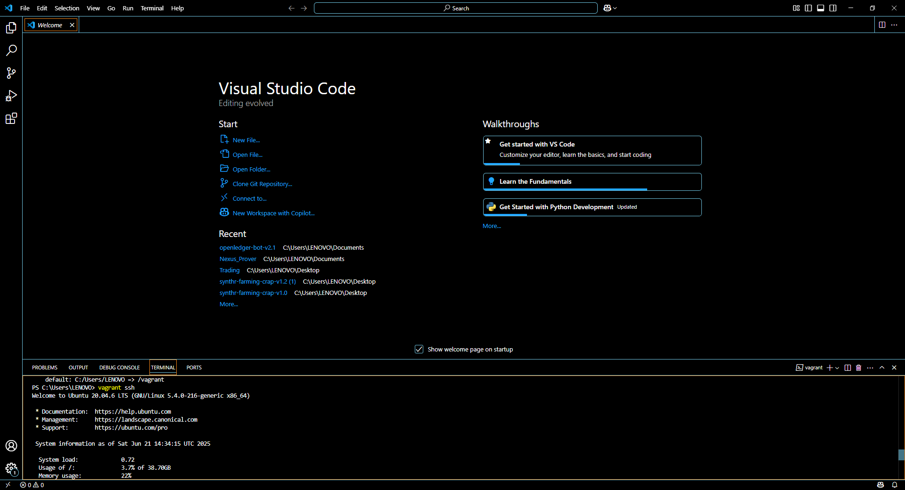
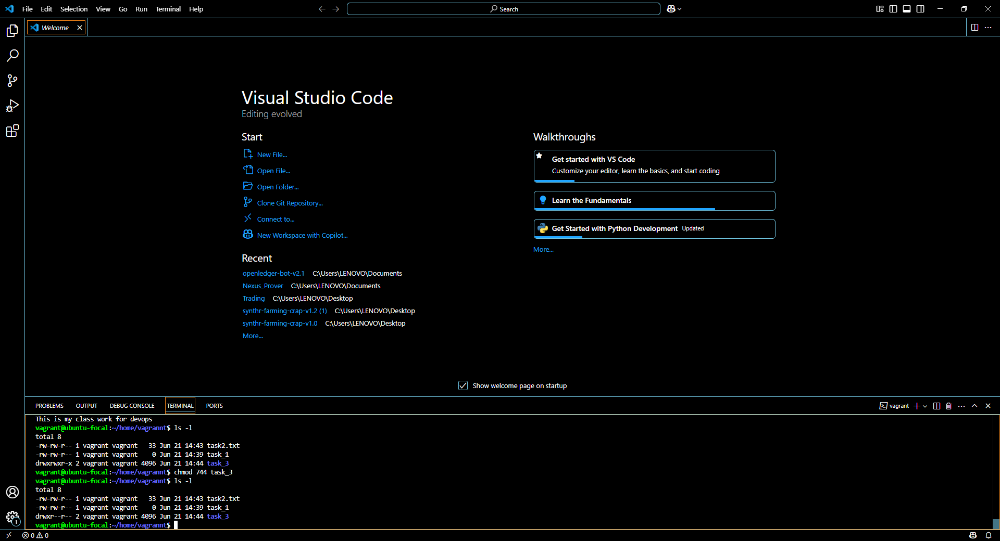
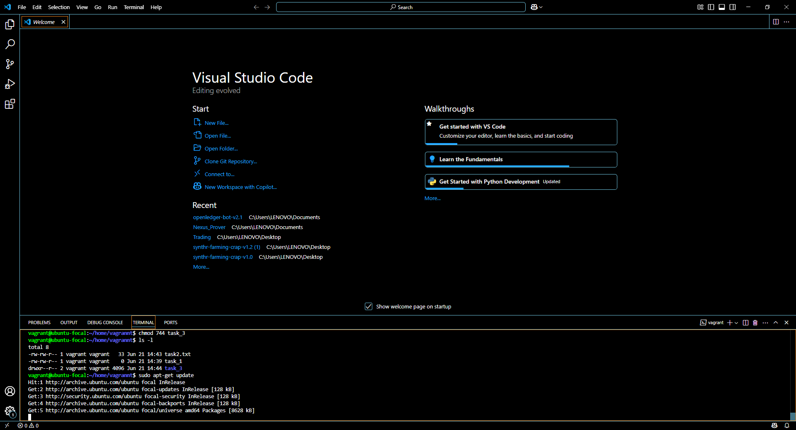
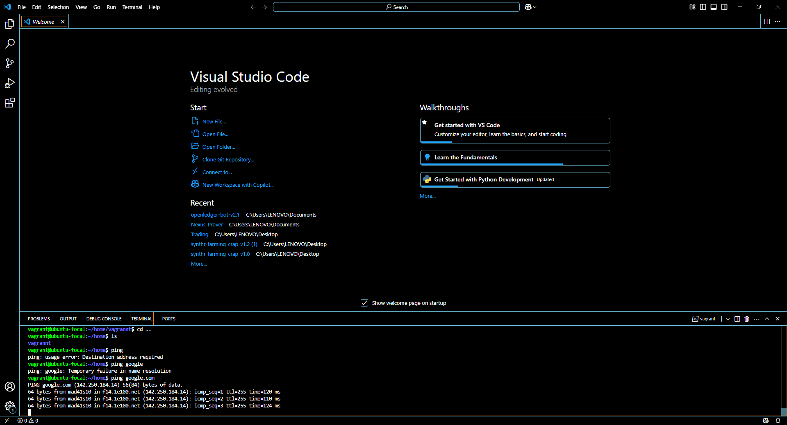

# linux-fundamentals-vagrant

I just SSh into vagrant in the image above and that is the screen shot 

 The screenshot is showing my file structure as asked in the assignment

The screenshot above is showing the permission level of my folders 

The screenshot above displays me install a package on my ubuntu vagrant cli

The screenshot above shows me using the ping command on the google.com 
